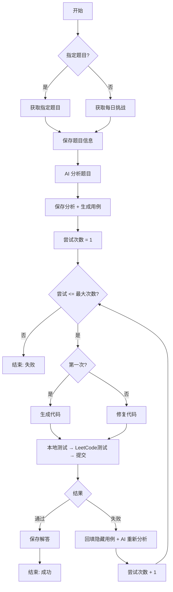
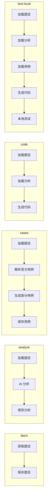
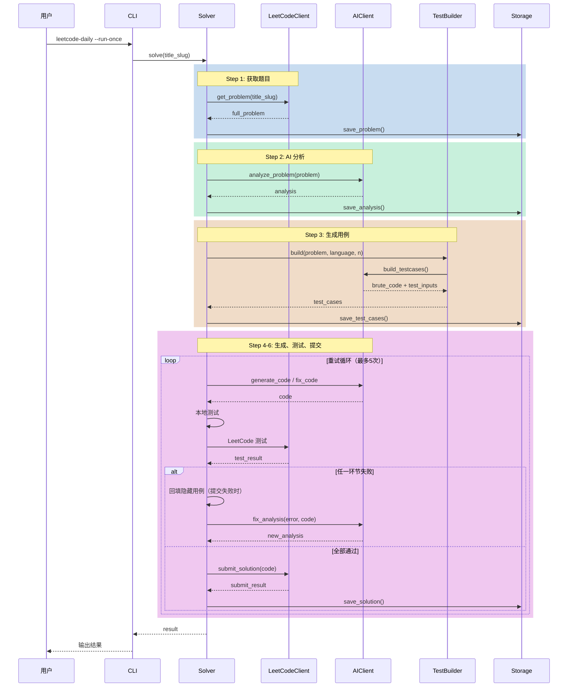
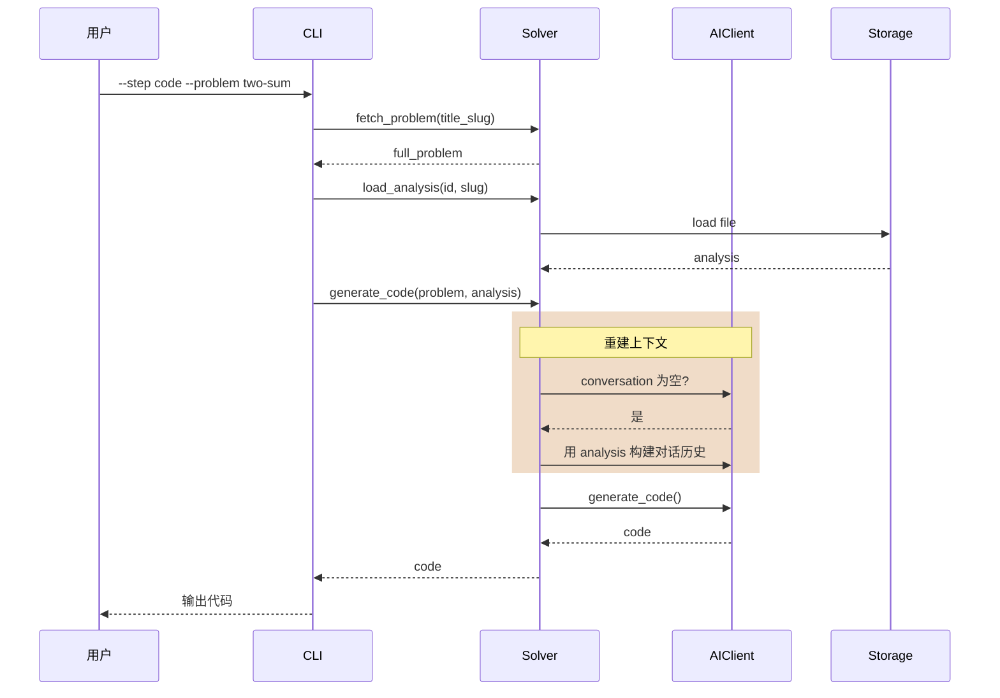
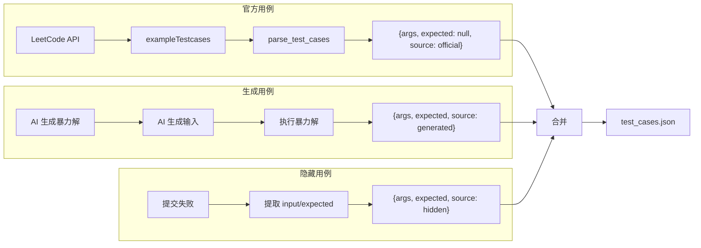
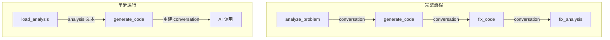

# 项目设计文档

## 目录

- [项目概述](#项目概述)
- [项目结构](#项目结构)
- [核心模块](#核心模块)
- [流程图](#流程图)
- [时序图](#时序图)
- [数据流](#数据流)
- [设计决策](#设计决策)
- [已知问题](#已知问题)

---

## 项目概述

LeetCode Daily Solver 是一个基于 AI 的自动刷题工具，能够：

1. 自动获取 LeetCode 每日挑战或指定题目
2. 使用 AI 分析题目并生成解题思路
3. 生成代码并通过本地测试 + LeetCode 在线验证
4. 失败时自动修复并重试

### 技术栈

| 组件 | 技术 |
|------|------|
| 语言 | Python 3.11+ |
| HTTP 客户端 | httpx |
| AI SDK | openai |
| 配置 | PyYAML |
| 日志 | loguru |
| 测试 | pytest + pytest-asyncio |
| 构建 | hatchling |

---

## 项目结构

```
leetcode-daily-solver/
├── src/
│   └── leetcode_daily_solver/
│       ├── __init__.py
│       ├── cli.py              # CLI 入口
│       ├── config.py           # 配置管理
│       ├── solver.py           # 核心求解器
│       ├── ai_client.py        # AI 客户端
│       ├── leetcode_client.py  # LeetCode API 客户端
│       ├── local_tester.py     # 本地测试运行器
│       ├── test_builder.py     # 差分测试用例生成
│       └── storage.py          # 文件存储管理
├── tests/
│   ├── conftest.py             # pytest 配置
│   ├── unit/                   # 单元测试
│   │   ├── test_ai_client.py
│   │   ├── test_leetcode_client.py
│   │   └── test_storage.py
│   └── integration/            # 集成测试
│       ├── conftest.py         # 集成测试 fixtures
│       ├── test_flow_cases.py  # 用例生成流程测试
│       └── test_flow_full.py   # 完整流程测试
├── problems/                   # 题目保存目录
│   └── {id}_{title-slug}/
│       ├── problem.md
│       ├── analysis.md
│       ├── solution.py
│       └── test_cases.json
├── config.yaml                 # 配置文件
├── config.example.yaml         # 配置示例
├── pyproject.toml              # 项目配置
├── README.md                   # 英文文档
├── README.zh-CN.md             # 中文文档
└── DESIGN.md                   # 本文档
```

---

## 核心模块

### 1. CLI (`cli.py`)

命令行入口，支持两种模式：

- **完整流程**：`--run-once` 或定时执行
- **单步执行**：`--step {fetch|analyze|cases|code|test-local}`

```python
# 关键函数
async def run_step(step, title_slug, config)  # 单步执行
async def run_once(title_slug, step)           # 一次性执行
def run_scheduled()                            # 定时执行
```

### 2. Solver (`solver.py`)

核心求解器，将流程拆分为独立方法：

```python
class DailySolver:
    # 独立步骤方法
    async def fetch_problem(title_slug)        # 获取题目
    def generate_analysis(full_problem)        # 生成分析
    def generate_test_cases(full_problem)      # 生成测试用例
    def generate_code(full_problem, analysis)  # 生成代码
    def test_code_local(code, test_cases)      # 本地测试
    async def test_code_leetcode(...)          # LeetCode 测试
    async def submit_solution(...)             # 提交解答
    
    # 辅助方法
    def load_analysis(question_id, title_slug) # 加载已有分析
    def load_test_cases(question_id, title_slug) # 加载已有用例
    
    # 完整流程
    async def solve(title_slug)                # 运行完整流程
```

### 3. AI Client (`ai_client.py`)

封装 OpenAI API 调用，管理对话上下文：

```python
class AIClient:
    conversation: list[dict]  # 对话历史
    
    def analyze_problem(problem)      # 分析题目
    def generate_code(problem, analysis, language)  # 生成代码
    def fix_code(problem, code, error, language)    # 修复代码
    def fix_analysis(problem, analysis, error, code)  # 重新分析
    def build_testcases(problem, num_cases, language)  # 生成测试用例
```

**关键设计**：`generate_code` 会检查对话历史，如果为空则自动用 `analysis` 重建上下文。

### 4. LeetCode Client (`leetcode_client.py`)

封装 LeetCode GraphQL API：

```python
class LeetCodeClient:
    async def get_daily_challenge()    # 获取每日挑战
    async def get_problem(title_slug)  # 获取题目详情
    async def run_code(...)            # 运行代码测试
    async def submit_solution(...)     # 提交解答
```

### 5. Test Builder (`test_builder.py`)

差分测试用例生成器：

```python
class TestBuilder:
    def build(problem, language, num_cases) -> list[dict]
```

工作流程：
1. 让 AI 生成暴力解（brute_solve）
2. 让 AI 生成测试输入
3. 执行暴力解获取期望输出
4. 返回 `{args, expected, source}` 格式的用例

### 6. Storage (`storage.py`)

文件存储管理：

```python
class Storage:
    def save_problem(...)       # 保存题目
    def save_analysis(...)      # 保存分析
    def save_solution(...)      # 保存解答
    def save_test_cases(...)    # 保存测试用例
    def load_test_cases(...)    # 加载测试用例
```

---

## 流程图

### 主流程



### 单步执行流程



---

## 时序图

### 完整流程时序图



### 单步执行时序图



---

## 数据流

### 测试用例格式



### 上下文传递



---

## 设计决策

### 1. 可降级设计

TestBuilder 采用可降级策略：

```
生成暴力解失败 → 退回官方用例
解析输出失败 → 退回官方用例
执行暴力解失败 → 跳过该用例
```

**原因**：差分测试是增强功能，不应阻塞主流程。

### 2. 上下文保持

AI 对话上下文在完整流程中保持连续：

```
analyze → generate_code → fix_code → fix_analysis
         (共享 conversation)
```

单步运行时通过 `load_analysis` + 自动重建解决。

### 3. 统一用例格式

所有测试用例统一为 `{args, expected, source}` 格式：

- `official`：官方用例，expected 为 null
- `generated`：AI 生成用例，expected 由暴力解计算
- `hidden`：提交失败回填的隐藏用例

### 4. 单步执行支持

Solver 拆分为独立方法，支持：

- 单独调试某个步骤
- 从任意步骤开始执行
- 复用已有结果（如加载已有分析）

---

## 已知问题

| # | 问题 | 位置 | 状态 |
|---|------|------|------|
| 1 | MiMo API 使用 `max_completion_tokens` 而非 `max_tokens` | `ai_client.py:30` | 已适配 |
| 2 | `__replace__` 在 Python 3.13+ 才可用 | `cli.py:155` | 已用 `dataclasses.replace()` |
| 3 | TestBuilder AI 输出偶尔格式不规范 | `test_builder.py:26` | 可降级，考虑增加重试 |
| 4 | pytest-asyncio teardown 事件循环关闭报错 | 测试框架 | 已知问题，不影响结果 |
| 5 | Cookie 字段检查 bug | `leetcode_client.py:44` | ✅ 已修复 |
| 6 | HTTP 客户端未关闭导致资源泄漏 | `solver.py`, `cli.py` | ✅ 已修复 |
| 7 | eval()/exec() 安全风险 | `local_tester.py`, `test_builder.py` | 个人项目，暂不处理 |

---

## 扩展点

### 添加新 AI 提供商

在 `ai_client.py` 中扩展 `_call_api` 方法。

### 添加新题目来源

在 `leetcode_client.py` 中实现新的 API 客户端。

### 自定义测试用例

在 `test_builder.py` 中扩展 `build` 方法，支持手动输入用例。

---

*文档最后更新：2026-08-17*
