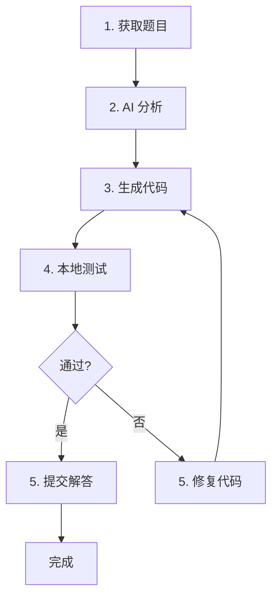

# LeetCode 每日刷题求解器

[](https://python.org)
[](LICENSE)

基于 AI 的 LeetCode 每日挑战自动求解器。

[English](README.md) | 中文

## 功能特性

- 🤖 **AI 驱动** - 使用 AI 分析题目并生成代码
- 🔄 **自动重试** - 根据测试失败自动修复代码
- ⏰ **定时执行** - 每天指定时间自动运行
- 📝 **多语言支持** - 支持 Python、Java、C++ 等
- 📊 **详细日志** - 完整的执行日志记录
- 💾 **本地保存** - 保存题目、分析和解答到文件
- 🇨🇳 **中文支持** - 获取中文题目描述
- 🧪 **差分测试** - AI 生成暴力解 + 测试用例进行本地验证
- 🔧 **步骤拆分** - 支持单独运行每个步骤，便于调试

## 工作流程



## 快速开始

### 1. 安装

```bash
git clone https://github.com/LYCGGG/leetcode-daily-solver.git
cd leetcode-daily-solver
pip install -e .
```

### 2. 配置

```bash
cp config.example.yaml config.yaml
```

编辑 `config.yaml`：

```yaml
ai:
  provider: openai
  model: mimo-v2.5-pro
  api_key: "your-api-key"
  base_url: "https://api.example.com/v1"

leetcode:
  site: cn
  session: "your-session-cookie"
  csrf_token: "your-csrf-token"

# 存储配置
save_problems: true
problems_dir: "problems"
```

或使用环境变量：

```bash
export OPENAI_API_KEY="your-api-key"
export LEETCODE_SESSION="your-session"
export LEETCODE_CSRF="your-csrf"
```

### 3. 运行

```bash
# 运行一次（每日挑战）
leetcode-daily --run-once

# 指定题目
leetcode-daily --run-once --problem two-sum

# 定时运行（每天 08:00）
leetcode-daily

# 使用不同语言
leetcode-daily --run-once --language java

# 详细输出
leetcode-daily --run-once -v
```

### 4. 单步运行

支持单独运行每个步骤，便于调试：

```bash
# 获取题目
leetcode-daily --step fetch --problem two-sum

# 生成分析
leetcode-daily --step analyze --problem two-sum

# 生成测试用例
leetcode-daily --step cases --problem two-sum

# 生成代码（自动加载已有分析）
leetcode-daily --step code --problem two-sum

# 本地测试（自动加载分析和用例）
leetcode-daily --step test-local --problem two-sum
```

## 配置说明

| 选项 | 说明 | 默认值 |
|------|------|--------|
| `ai.provider` | AI 提供商 (openai/claude) | openai |
| `ai.model` | 模型名称 | qwen3.8-max-preview |
| `ai.api_key` | API 密钥 | - |
| `ai.base_url` | 自定义 API 端点 | - |
| `leetcode.site` | LeetCode 站点 (cn/global) | cn |
| `leetcode.session` | Session cookie | - |
| `leetcode.csrf_token` | CSRF token | - |
| `schedule.time` | 每日运行时间 | 08:00 |
| `language` | 编程语言 | python3 |
| `max_retries` | 最大重试次数 | 5 |
| `save_problems` | 保存题目到文件 | true |
| `problems_dir` | 题目保存目录 | problems |
| `num_generated_cases` | 差分测试用例数 | 5 |

## 输出结构

```
problems/
  0001_two-sum/
    problem.md              # 题目描述（中文）
    analysis.md             # AI 分析
    solution.py             # 解答代码
    test_cases.json         # 测试用例（官方 + 生成）
  1140_stone-game-ii/
    problem.md
    analysis.md
    solution.py
    test_cases.json
```

## 测试用例格式

测试用例统一保存为 JSON 格式：

```json
[
  {
    "args": [[2, 7, 11, 15], 9],
    "expected": null,
    "source": "official"
  },
  {
    "args": [[1, 2, 3], 5],
    "expected": [1, 2],
    "source": "generated"
  }
]
```

| 字段 | 说明 |
|------|------|
| `args` | 函数参数列表 |
| `expected` | 期望输出（官方用例为 null） |
| `source` | 来源：official / generated / hidden |

## 运行测试

```bash
# 单元测试
pytest tests/unit -v

# 集成测试（需要 API 访问）
pytest tests/integration -v --integration
```

## 示例输出

```
11:30:00 | INFO    | ==================================================
11:30:00 | INFO    | Starting Daily Challenge Solver
11:30:00 | INFO    | ==================================================
11:30:01 | INFO    | Step 1: Fetching daily challenge...
11:30:01 | INFO    | Problem: Two Sum (EASY)
11:30:02 | INFO    | Step 2: Fetching problem details...
11:30:03 | INFO    | Step 3: Analyzing problem with AI...
11:30:08 | INFO    | Step 4: Generating code (attempt 1)...
11:30:15 | INFO    | Step 5: Testing code...
11:30:20 | INFO    | ✓ Code accepted!
11:30:21 | INFO    | Step 6: Submitting solution...
11:30:25 | INFO    | ✓ Solution accepted!
11:30:25 | INFO    | ==================================================
11:30:25 | INFO    | Result: success
11:30:25 | INFO    | ==================================================
```

## 许可证

MIT
